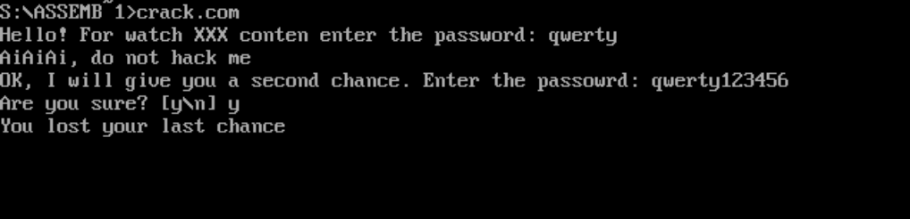
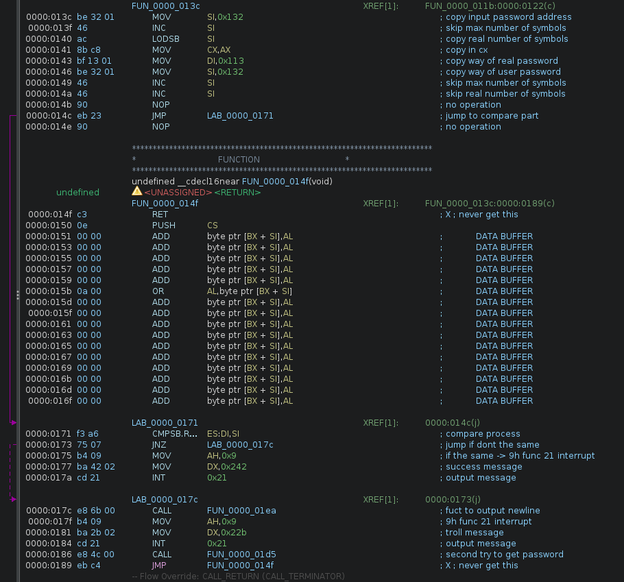
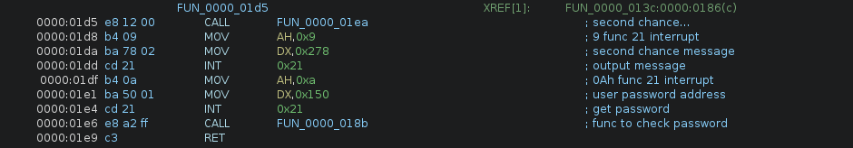
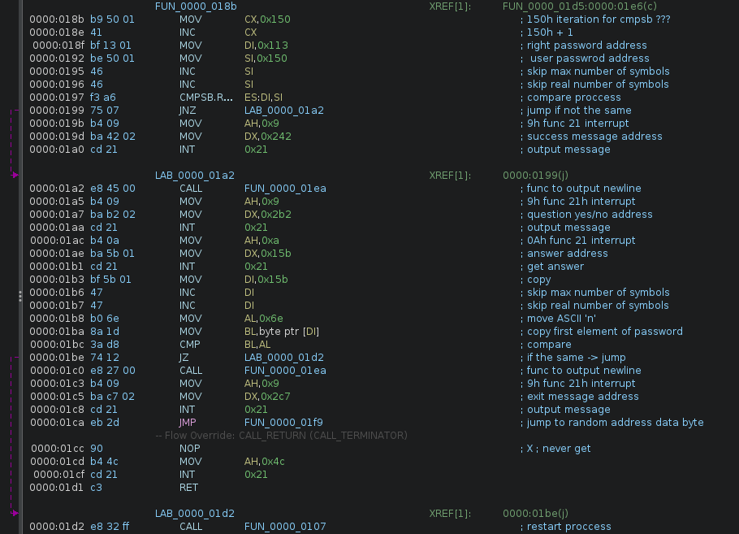
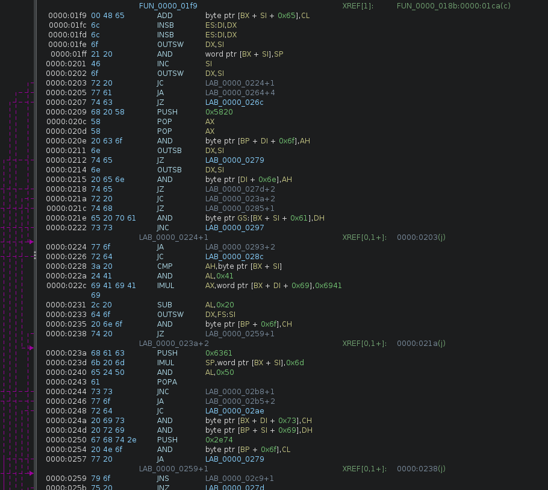
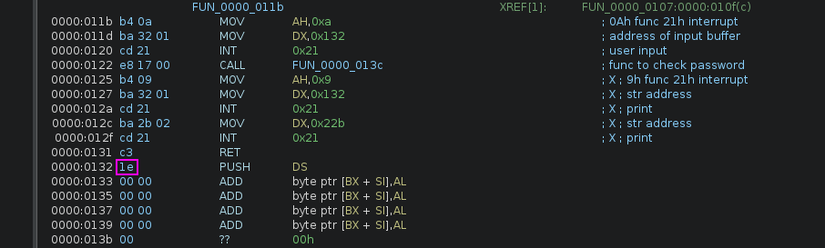
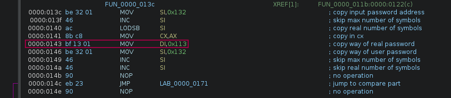
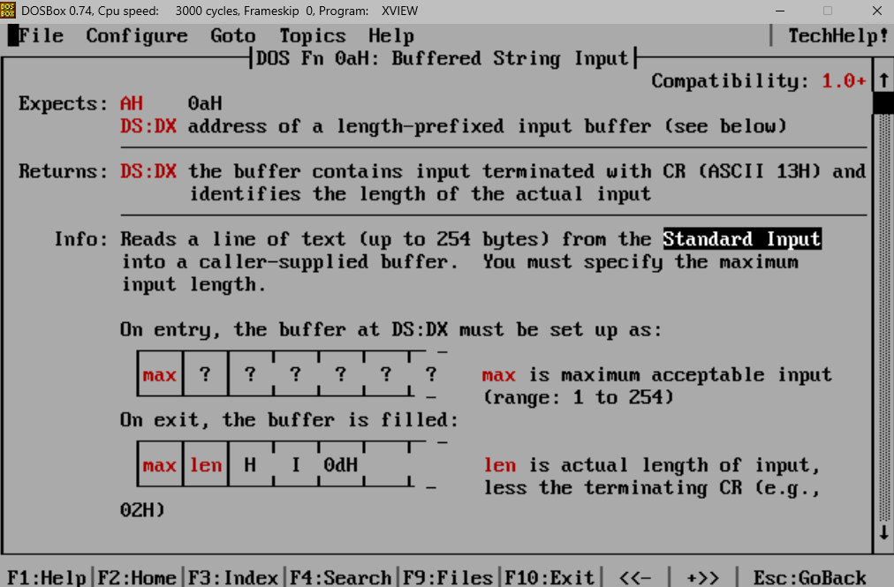
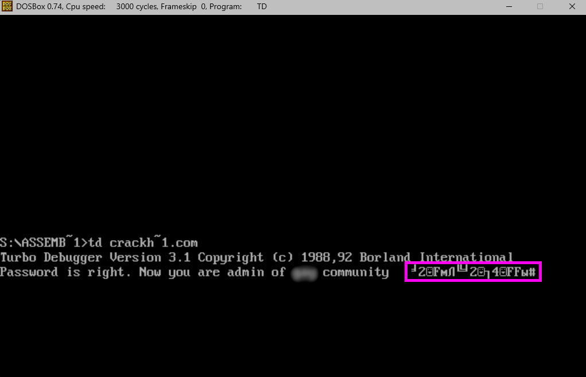

# General information

This is the final task of the DOS assembler course by [Ilya Dedinsky](https://github.com/ded32).

My course friend, [Egor](https://github.com/4Locker4) and I wrote two CrackMe programs and sent them to each other for hacking.
The programs are similar in its idea: the user must enter a password, if its correct, an inscription corresponding to this will appear. The goal is to receive this message without knowing the password.

# Content

- [Egor's program (CRACK.COM)](#Egor's-program-(CRACK.COM))
    - [How to program works](#How-to-program-works)         
    - [Vulnerability 1: buffer overflow](#Vulnerability-1:-buffer-overflow)
    - [Vulnerability 2: buffer overflow but more interesting](#Vulnerability-2:-buffer-overflow-but-more-interesting)
- [My program](#My-program)
    - [Vulnerability 1: love jmp](#Vulnerability-1:-love-jmp)
    - [Vulnerability 2: stack overflow](#Vulnerability-2:-stack-overflow)
- [My Patcher](#My-Patcher)

# Egor's program (CRACK.COM)

## How to program works

### Program in action

The program greets the user like this:

The program is designed in an interesting way, here is an example of its use for understanding:

An interesting fact: after answering the last question 'y' (yes), the program freezes and I have to restart DOS (my touchpad has already been erased to the keyboard chips)

### Disassembler analysis

I used Ghidra to disassemble the program. Ghidra is a software reverse engineering (SRE) framework created and maintained by the 
[National Security Agency](nsa) Research Directorate.

#### Main function (Address: 0x0100 - 0x0105)

The main function **calls** a single function, that prints an input prompt.

#### Function for printing input prompt (Address: 0x0107 - 0x0112)

The function clears the flag, prints a greeting and an invitation to enter a password.

At the end, a function is **called** to get the password.

#### Function to get password <1st attempt> (Address: 0x011b - 0x013b)

This function accepts the password using the 0Ah function of 21 interrupt. Please note that the code from address 0x0125 will never be executed, this is how the program works, it will be better seen below.

Here the function is **called** to check the password.

#### Function to check password <1st attempt> (Address: 0x013c - 0x0189)

The content of the function is quite strange, there is some buffer in the middle of it, because of this the disassembler detects some function, although it is unlikely to be a function.
Note, that at the end of the function there is a jump to a "function" in the middle, but the program is designed so that we will never get to it (a function is called before it, which either ends the program by hanging, or returns us to the beginning of the program).

Here **two** functions are **called** (without the function before the buffer):
 - Function to output a new line
 - Function to get the password on the second attempt

#### Function to output a new line (Address: 0x01ea - 0x01f8)

Just a function to go to a new line.

#### Function to get password <2nd attempt> (Address: 0x01d5 - 0x01e9)

Similar to the first function for getting the password, we get a prompt to enter the password and enter it.

Next, the function is **called** to check the password.

#### Function to check password <2nd attempt> (Address: 0x018b - 0x01d2)

From the disassembled code we can see that the second attempt will never match the correct password, because cmpsb will perform a large number of iterations due to the large value in CX.

Also here we can see what was said earlier: the program either takes us back and gives us two more input attempts or performs a jmp to an obscure address. 
We understand that this is the memory area where strings are stored that invite the user to enter the password for the whole program:

## Vulnerability 1: buffer overflow

The first vulnerability I found was in this place in the code:

At address 0x0120 the user fills the buffer at address 0x0132, where the first byte means the maximum number of characters that can be entered - this is how the 0Ah 21 interrupt function works (see below DOS thelp). 

At address 0x0132 we see byte 1e16 = 3010 characters user can enter, this is more than the allocated buffer, which means we can change the program code with our input. 
Idea: let's change the address from 0x0113 to 0x0132 at address 0x0143. Then we are comparing two identical strings. This combination of symbols breaks the program:

This combination restores the source code, but with a converted string at address 0x0143. 

And we see the message about the correct password :white_check_mark:.

