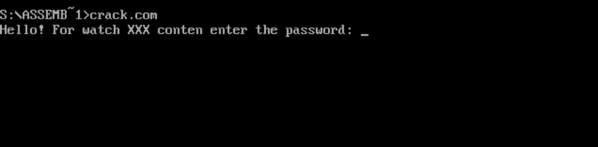

# General information

This is the final task of the DOS assembler course by [Ilya Dedinsky](https://github.com/ded32).

My course friend, [Egor](https://github.com/4Locker4) and I wrote two CrackMe program and sent them to each other for hacking.
The programs are similar in its idea: the user must enter a password, if its correct, an inscription corresponding to this will appear. The goal is to receive this message without knowing the password.

# Content

- [Egor's program (CRACK.COM)](#Egor's-program-(CRACK.COM))
    - [How to program works](#How-to-program-works)         
    - [Vulnerability 1: buffer overflow](#Vulnerability-1:-buffer-overflow)
    - [Vulnerability 2: buffer overflow but more interesting](#Vulnerability-2:-buffer-overflow-but-more-interesting)
- [My program](#My-program)
    - [Vulnerability 1: love jmp](#Vulnerability-1:-love-jmp)
    - [Vulnerability 2: stack overflow](#Vulnerability-2:-stack-overflow)
- [My Patcher](#My-Patcher)

# Egor's program (CRACK.COM)

## How to program works

### Program in action

The program greets the user like this:

The program is designed in an interesting way, here is an example of its use for understanding:

An interesting fact: after answering the last question 'y' (yes), the program freezes and I have to restart DOS (my touchpad has already been erased to the keyboard chips)

### Disassembler analysis

I used Ghidra to disassemble the program. Ghidra is a software reverse engineering (SRE) framework created and maintained by the 
[National Security Agency](nsa) Research Directorate.

#### Main function (Address: 0x0100 - 0x0105)

The main function calls a single function, the function that does all the work. 

#### 

## Vulnerability 1: buffer overflow

